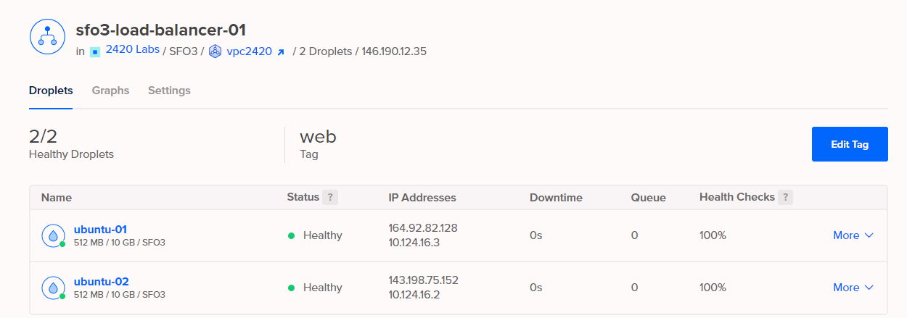
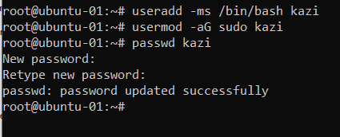
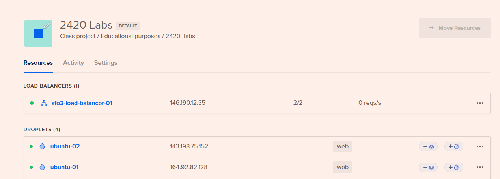
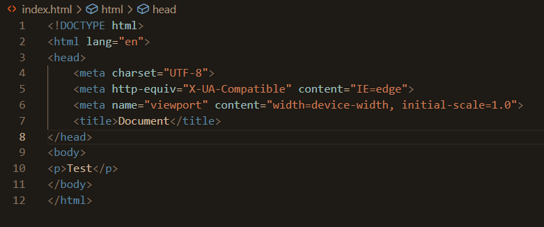

## Kazi

## Step 0 VPC setup based on D2L video not necesary to cover here 

## Step 1 Create Digital Ocean droplet

1. Create an account on Digital Ocean (https://www.digitalocean.com/)
2. Open Windows terminal to generate ssh keys by typing ssh-keygen
3. Create a file in which to save the key (i.e. /Users/<username/.ssh/)
4. Copy the public key using the command: cat ~/.ssh/<key_name.pub
	Where <key_name> is the name given for your key
6. Go to Settings in Digital Ocean then Security
7. Click  Add SSH Key
8. Paste key
9. Create a new project or a select an existing project
10. Select the ssh keys created to use with the droplets
11. Create tags to group the droplets

## Step 2 Create Digital Ocean Load Balancer

1. In Digital Ocean click Networking on the left hand menu
2. Click on Load Balancers
3. Click on Create Load Balancer
4. Choose a datacenter region which is the same one that is used to create your droplets
5. Select the same tags for your droplets in the load balancer to group them together
6. Click on Create

## Step 3 Create Digital Ocean Firewall

1. Click on Networking
2. Click on Firewalls
3. Name the firewall
4. For inbound rules keep SSH selected
5. Drop down New Rule and select HTTP
5. On HTTP field source type "load" to populate the name of your load balancer
6. Specify the tag to group the loadbalancer, the firewall and the 2 tags
7. Click on Create

## Step 4 Create a new user on droplet, do this for both droplets

1. From terminal on the host machine
2. Type ssh -i ~/.ssh/<key_name_on_machine> root@<IP address of droplet>
3. Type useradd -ms /bin/bash <username>
4. Type usermod -aG sudo <username>
5. Type passwd <username>
6. Enter password
7. Run rsync --archive --chown=<username>:<username> ~/.ssh /home/<username> to move ssh keys
8. Disable root access by changing root permission to no in /etc/ssh/sshd_config
9. Run sudo apt update and sudo apt upgrade
10. Run sudo systemctl restart ssh

## Step 5 Install Caddy in Droplets through Terminal 
1. Run wget https://github.com/caddyserver/caddy/releases/download/v2.6.2/caddy_2.6.2_linux_amd64.tar.gz
2. Run tar xvf caddy_2.6.2_linux_amd64.tar.gz
3. Run sudo cp caddy /usr/bin

## Step 6 Create index files
1. Create a directory called 2420-assign-two
3. Inside this directory create two sub-directories called html and src
4. Inside the html directory create an index.html page

## Step 7 Install nodejs and fastify

1. Install nodejs by going in to src directory and typing npm init
2. Install fastify by typing npm i fastify
3. Inside src directory create a file named index.js and paste inside the following content:
<pre>
// Require the framework and instantiate it
const fastify = require('fastify')({ logger: true })

// Declare a route
fastify.get('/api', async (request, reply) => {
  return { hello: 'server X' }
})

// Run the server!
const start = async () => {
  try {
    await fastify.listen({ port: 5050, host: '127.0.0.1' })
  } catch (err) {
    fastify.log.error(err)
    process.exit(1)
  }
}
start()
</pre>
4. Test your server locally by running npm init, then npm i fastify and running node index
5. Move both your html and src directory to both of your servers using sftp:

6. cd to where the directory assign-two located.
7. sftp -i ~/.ssh/DO2_key <user>@<ubuntu-1 or ubuntu-2 droplet ip address>
8. put -r 2420-assign-two

9. Copy /html/index.html inside assign-two directory:
- cd to 2420-assign-two directory:cd 2420-assign-two
- Make directory /var/www: sudo mkdir -p /var/www/<load balancer ip address>/
- Copy the index.html in var/www: sudo cp -r html /var/www/<load balancer server ip address>/

## Step 8 Add Caddy Configuration
1. sudo mkdir /etc/caddy
2. sudo vim /etc/caddy/Caddyfile
<pre>
http://<load balancer ip address> {
  root * /var/www/<server load balancer ip address)
  file_server
  reverse_proxy /api localhost:5050
}</pre>

## Step 9 Create Caddy Service
1. sudo vim /etc/systemd/system/caddy.service
2. Update caddy.service content: 
<pre>[Unit]
Description=Serve HTML in /var/www using caddy
After=network.target

[Service]
Type=notify
ExecStart=/usr/bin/caddy run --config /etc/caddy/Caddyfile
ExecReload=/usr/bin/caddy reload --config /etc/caddy/Caddyfile
TimeoutStopSec=5
KillMode=mixed

[Install]
WantedBy=multi-user.target</pre>

3. sudo systemctl daemon-reload
4. sudo systemctl start caddy.service
5. sudo systemctl status caddy.service

## Step 10 Install Volta
1. Run: curl https://get.volta.sh | bash
2. source ~/.bashrc
3. volta install node

## Step 11 Install hello_web
1. Create hello_web.service file: sudo vim /etc/systemd/system/hello_web.service
2. Add content:
<pre>[Unit]
Description=To run the node application so that load balancer can access
After=network-online.target
Wants=network-online.target

[Service]
ExecStart=/home/kazi/.volta/bin/node /home/kazi/src/index.js
User=kazi
Group=kazi
Restart=always
RestartSec=10
TimeoutStopSec=90
SyslogIdentifier=hello_web

[Install]
WantedBy=multi-user.target
</pre>

3. Enable and Start hello_web.service:
- systemctl enable hello_web.service
- systemctl start hello_web.service

4. Visit load balancer and refresh to see messages from both servers: http://146.190.12.35/
5. Can also test <above url>/api

Important troubleshooting commands:
- sudo systemctl daemon-reload
- caddy reload --config /etc/caddy/Caddyfile

